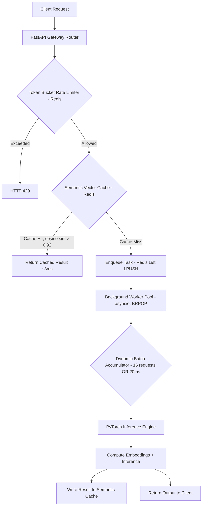

# SemanticQueue

An asynchronous, multi-tenant ML inference gateway built in Python. It sits in front of a machine learning model and makes it cheaper and faster to serve at scale — without needing more GPUs.

## What it does

Most naive ML-serving setups run one inference call per request, with no protection against traffic spikes and no reuse of prior work. SemanticQueue adds three layers in front of the model, each solving a different part of that problem:

1. **Rate limiting (token bucket, Redis-backed)** — protects the system from being overwhelmed before any expensive work starts.
2. **Semantic caching** — before running the model, checks whether a *semantically similar* request has already been answered (using embedding similarity, not just exact string matching), and returns the cached result in milliseconds if so.
3. **Dynamic batching** — when a request does need the model, it's grouped with other concurrent requests into a batch (up to a size or time limit, whichever comes first) so the model runs more efficiently per request instead of one at a time.

The result is a system that avoids redundant computation when it can, and makes the computation it does run as efficient as possible when it can't.

## Why it's built this way

- **FastAPI + asyncio**: the gateway itself is fully non-blocking — I/O (Redis calls, queueing) never blocks the event loop, so the API stays responsive under load.
- **Redis**: used for three different jobs at once — rate-limit counters, the semantic cache (storing embeddings + results), and a lightweight task queue (via Redis Lists) connecting the API to background workers.
- **PyTorch + sentence-transformers**: a small embedding model (`all-MiniLM-L6-v2`) generates vectors for semantic comparison; inference runs off the main event loop so it doesn't block other requests while computing.

## Architecture

## Tech stack

- **Language**: Python 3.12+
- **API layer**: FastAPI, Uvicorn
- **Store / cache / queue**: Redis 7.x (`redis.asyncio`)
- **ML**: PyTorch, sentence-transformers (`all-MiniLM-L6-v2`), NumPy
- **Infra**: Docker, Docker Compose
- **Load testing**: Locust
- **Testing**: pytest, httpx

## Status

Actively being built — see `plan.md` for the phased roadmap and `progress.md` for current status.

## What this isn't

This is a portfolio-scale project, not a production system. Notably:
- No auth on the API
- Redis List as a queue instead of a real message broker (no delivery guarantees, no dead-letter handling)
- Single-node design — the rate limiter and cache work correctly across multiple API instances since state lives in Redis, but there's no load balancer or multi-node deployment here

These are known, deliberate scope cuts — see `plan.md` for what I'd add given more time.
