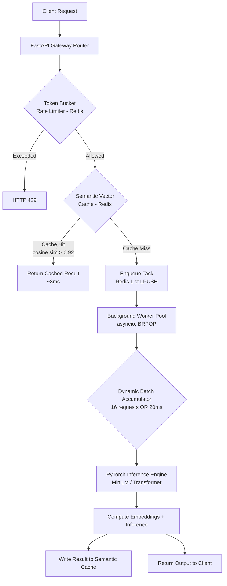

# SemanticQueue — Build Plan

Async ML Task Queue & Semantic Inference Gateway.

## Goal
Finish the base project (Phases 1–6) first. Stretch goals are separate and only attempted after the base is fully working and demoable.

## Timeline (5 days)
- Day 1: Phase 1 + Phase 2
- Day 2: Phase 3
- Day 3: Phase 4
- Day 4: Phase 5
- Day 5: Phase 6 + buffer / polish / README

---

## Architecture Flow

This is the diagram to keep open while building — every phase below maps to one box in this flow.

---

## Tech Stack
- **Language:** Python 3.12+
- **API layer:** FastAPI, Uvicorn
- **Store/Cache/Queue:** Redis 7.x (`redis.asyncio`)
- **ML:** PyTorch, sentence-transformers (`all-MiniLM-L6-v2`), NumPy
- **Infra:** Docker, Docker Compose
- **Load testing:** Locust
- **Testing:** pytest, httpx

## Environment
- WSL2 (Ubuntu) + Docker Desktop with WSL2 backend
- All work done inside the WSL2 native filesystem, not `/mnt/c/...`

---

## Phase 1: Environment & Container Setup
- [ ] Project structure: `/app`, `/config`, `/workers`, `/tests`
- [ ] Dockerfile + docker-compose.yml with two services: `api` (FastAPI) and `redis` (Redis 7.x)
- [ ] `requirements.txt` with pinned versions: fastapi, uvicorn, redis, torch, sentence-transformers, numpy, locust
- **Done when:** `docker-compose up` boots both containers cleanly, `redis-cli ping` works from inside the api container.

## Phase 2: Async API Gateway & Token Bucket Rate Limiter
- [ ] FastAPI entry point in `app/main.py`
- [ ] Async `TokenBucketRateLimiter` using `redis.asyncio`
  - Key schema: `rate_limit:{client_id}`
  - `client_id` is read from an `X-Client-ID` request header (used as the rate-limit key and general tenant identifier)
  - Request missing `X-Client-ID` is rejected with HTTP 400 — no anonymous/shared fallback bucket
  - N tokens per time window (e.g. 100 req/min)
  - Return HTTP 429 when empty
- [ ] `/health` and `/v1/predict` endpoints
  - `/v1/predict` is synchronous: the request holds the connection open and awaits the worker's result via an `asyncio.Future` (or `asyncio.Event` + shared dict) keyed by `task_id`, held in the API process and resolved by the worker once it writes the result — not Redis pub/sub, which is unnecessary subscribe/unsubscribe overhead for a single-node setup. Returns the actual output in the same response. No separate result-polling endpoint in the base project — see Stretch 4.
- **Done when:** hammering `/v1/predict` past the limit reliably returns 429, and it resets after the window.

## Phase 3: Redis Semantic Vector Cache
- [ ] `app/cache.py`
  - Exact-string match check first (cheap)
  - If no exact match: embed with sentence-transformers (all-MiniLM-L6-v2)
  - Cosine similarity check against cached vectors — brute-force in Python: embeddings stored as plain Redis values/hashes, candidates pulled back into the process and compared with NumPy (no RediSearch/Redis Stack vector module — plain Redis 7.x)
  - Threshold: 0.92 → CACHE_HIT, else CACHE_MISS
- **Done when:** two differently-worded but semantically similar prompts hit the same cache entry; log clearly shows HIT vs MISS.

## Phase 4: Async Task Queue & Dynamic Batching Worker
- [ ] Producer: push `{task_id, payload}` to Redis List via `LPUSH ml_task_queue`
- [ ] `workers/inference_worker.py`
  - Pop tasks with `BRPOP`
  - Dynamic batcher: batch_size=16 OR max_delay=20ms, whichever first
  - Run batched forward pass in PyTorch: compute the MiniLM embedding, then feed it to a mock downstream task (e.g. a toy classifier/similarity score) — the embedding itself is not the response payload, it's what gets cached; the mock task's output is what the client receives
  - Write results + embeddings back to semantic cache
  - Mark task COMPLETED
- [ ] **Result delivery back to the API process (settled design):** the worker
  runs as a separate OS process from the API and cannot directly resolve an
  in-process `asyncio.Future` (see Phase 2's open question in
  `phases/phase-2.md`). Resolved as follows:
  - The worker writes each finished result to Redis via `LPUSH` onto a
    dedicated results list (e.g. `predict_results`), tagged with `task_id`
    — distinct from `ml_task_queue` (the work queue) and distinct from the
    semantic cache (different Redis structure, different purpose:
    request/response delivery, not similarity lookup).
  - The API process runs one long-lived background `asyncio` task, started
    at app startup, doing a continuous `BRPOP` loop against that results
    list — not periodic polling. On each result popped, it looks up the
    matching `task_id` in `pending_results` and resolves that `Future`.
  - This is still not Redis pub/sub: one internal listener loop per API
    process, not a per-request subscribe/unsubscribe.
- **Done when:** submitting many concurrent requests visibly gets grouped into batches (log batch sizes), not processed one-by-one; and results produced by the worker correctly resolve the originating request's `/v1/predict` call via the `BRPOP` listener loop, not a direct cross-process Future call.

## Phase 5: Testing & Telemetry
- [ ] Structured JSON logs: `latency_ms`, `cache_status`, `batch_size`, `qps`
- [ ] pytest + httpx tests: rate limiting behavior, cache hit/miss correctness, batching accuracy
- **Done when:** test suite passes, logs are readable and would let you explain a request's full journey after the fact.

## Phase 6: Load Benchmarking
- [ ] `locustfile.py` simulating 500+ concurrent clients on `/v1/predict`
- [ ] Run 3 scenarios: cold (0% cache), warm (high cache hit), overload (429 enforcement)
- [ ] Record: peak QPS, p50/p95/p99 latency, % latency reduction cache-hit vs cache-miss
- **Done when:** you have real numbers you can quote in an interview, not estimates.

---

## Stretch Goals (only after base project fully works)
Do at most one fully; the rest can stay as "here's what I'd add next" talking points.

### Stretch 1: Adaptive Similarity Threshold (lowest effort — do this one first if time allows)
- Instead of hardcoded 0.92, track outcomes over a rolling window (e.g. last N cache hits) and log an estimated false-hit rate
- Adjust threshold up/down based on that signal
- Talking point: shows the cache tuning itself rather than being a fixed magic number

### Stretch 2: Cost-Aware Dynamic Batching
- Replace fixed `batch_size=16` / `max_delay=20ms` with logic that reacts to current queue depth
- Queue backing up → batch bigger/faster; queue quiet → don't force unnecessary wait
- Talking point: batching adapts to load instead of being static

### Stretch 3: Cache Staleness / Drift Handling
- Add TTL to cached entries, or a simple confidence-decay over time
- Be ready to explain *why* this matters: semantic caches can return a stale-but-still-similar-looking answer for time-sensitive queries (e.g. "who is the CEO of X") even though the embedding hasn't changed
- Talking point: shows awareness of a real, underdiscussed weakness of semantic caching

### Stretch 4: Async Result Delivery
- `/v1/predict` optionally returns a `task_id` immediately (e.g. via a query param or header toggle) instead of holding the connection open
- New `GET /v1/result/{task_id}` endpoint lets the client poll until the task is COMPLETED
- Talking point: shows both delivery models and the tradeoff — simplicity/lower latency of sync-wait vs. scalability of a decoupled polling model under long-tail inference latency

### Stretch 5: RediSearch (Redis Stack) Vector Search — DONE, see `phases/phase-7.md`
- Replace Phase 3's brute-force NumPy cosine scan (`HGETALL` every cached embedding into
  the API process, `json.loads` + matrix build + cosine compute in a Python loop) with
  RediSearch's HNSW vector index and a real `FT.SEARCH ... KNN` query
- This was always the natural upgrade path flagged back in Phase 3 (`plan.md`'s
  "Vector similarity search implementation" decision explicitly chose brute-force over
  RediSearch for the base project, on the grounds that a base-project-scale cache didn't
  need it yet)
- Phase 6's load test turned "the natural upgrade path" into "the fix for a documented,
  measured 67.7% timeout rate at 500 concurrent clients" — see `phases/phase-7.md` for
  the before/after numbers
- Talking point: shows the difference between "brute-force is fine at small scale" and
  knowing exactly which real infrastructure (RediSearch, not a bigger EC2 instance) fixes
  it once it isn't — and having the actual measured numbers to back up *why* it was
  swapped, not just that it theoretically scales better

### Not building, but know the answer for:
- Multi-tenant fairness (round-robin batching across client_ids instead of pure FIFO) — good answer to "how would you handle a noisy neighbor problem"
- Swapping Redis List for RabbitMQ/Kafka — know what you'd gain (ack/retry, dead-letter queue, durability) and why you didn't need it for a portfolio-scale project

---

## Interview Prep Reminders
- Know your numbers cold: rate limit config, similarity threshold, batch_size, max_delay — and *why* those values
- Be ready to explain the async/blocking distinction for the PyTorch forward pass (why it needs to run off the event loop)
- Don't oversell "novelty" — frame it as informed engineering trade-offs, not invention
- Have a one-line answer ready for "what would you do with more time" → point at the stretch goals list above
